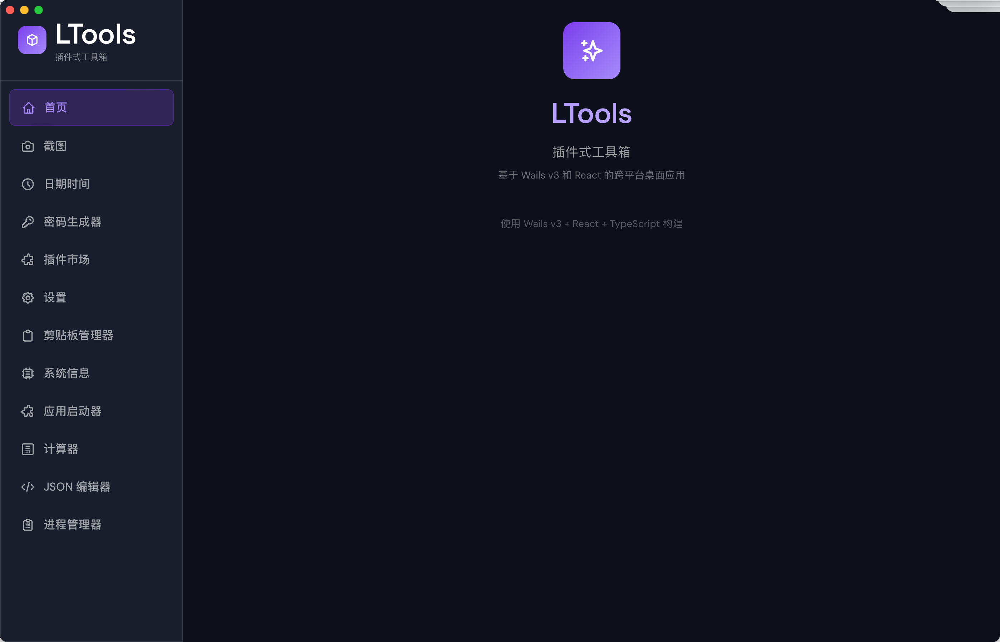
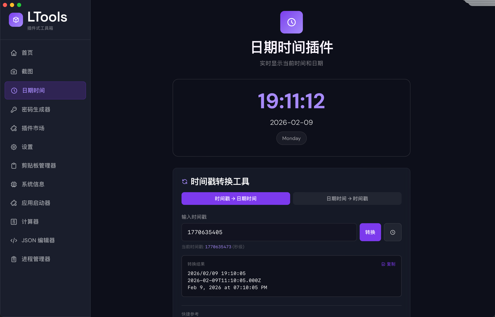
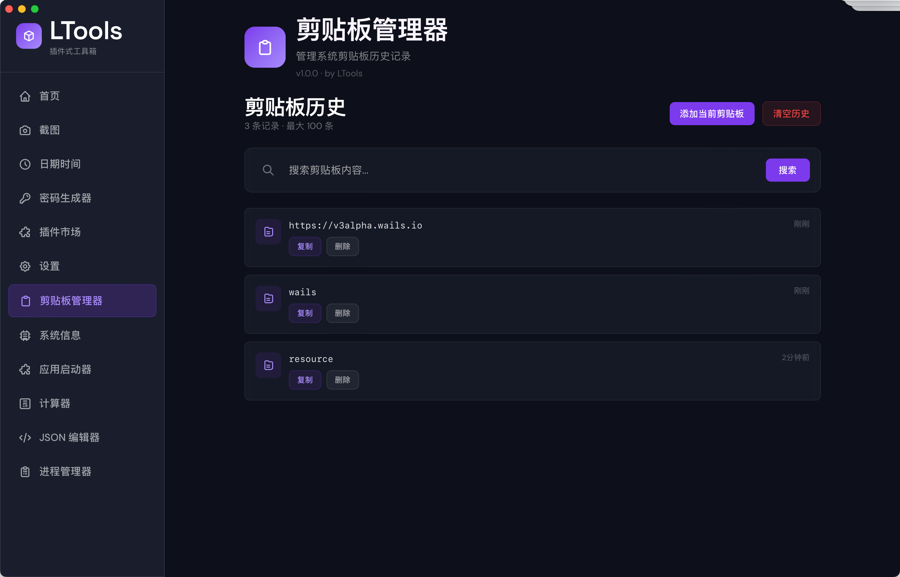
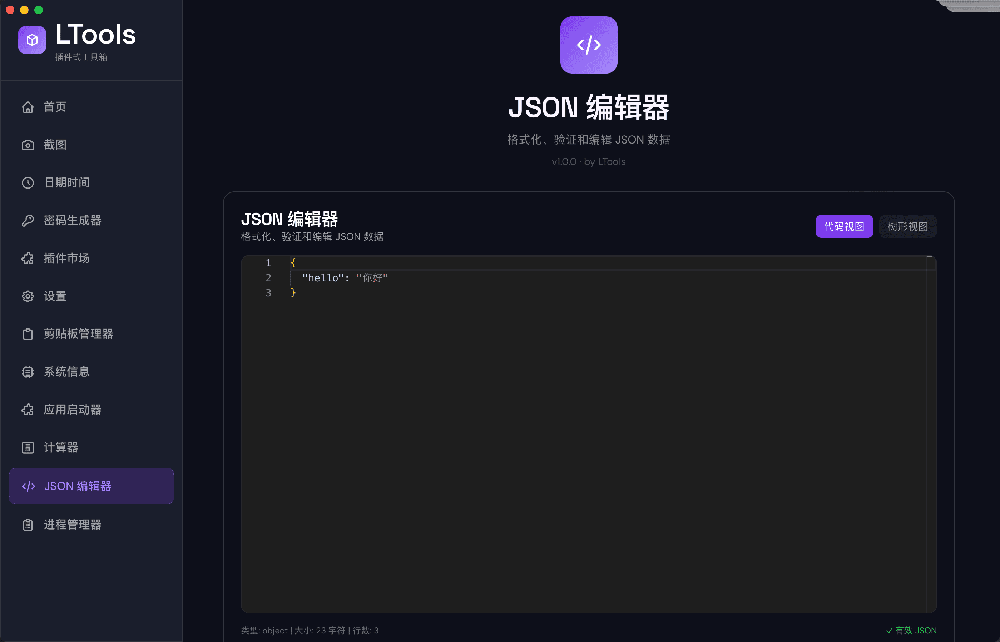
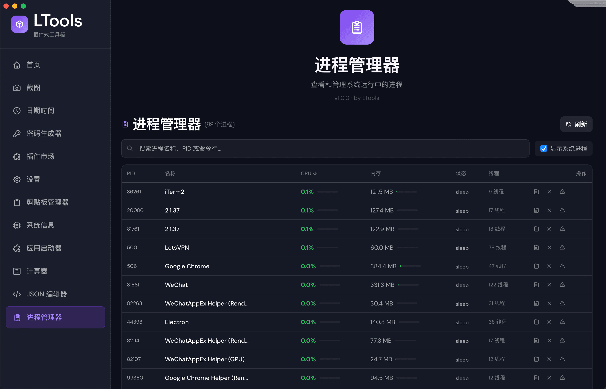
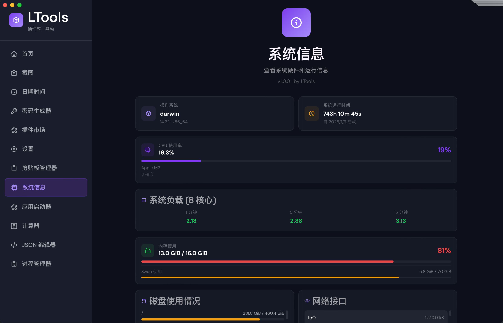
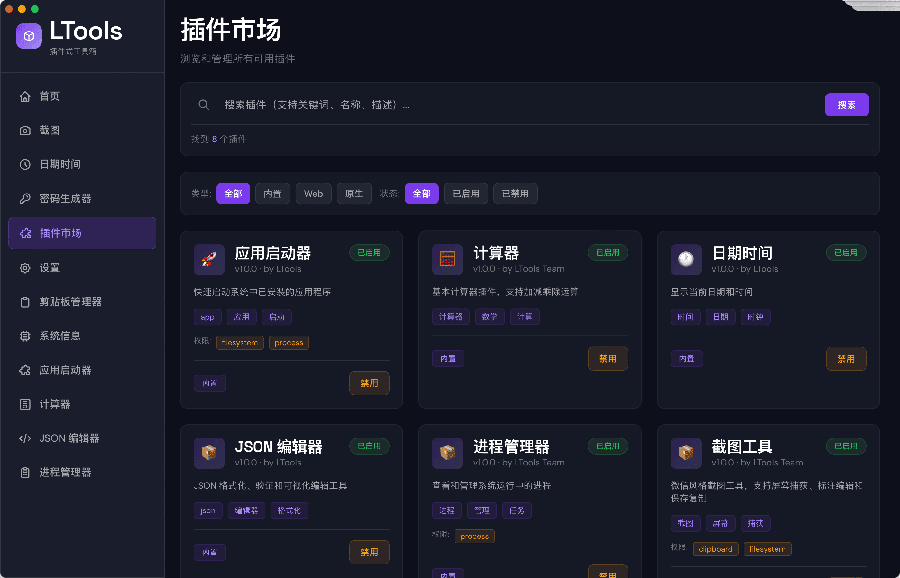
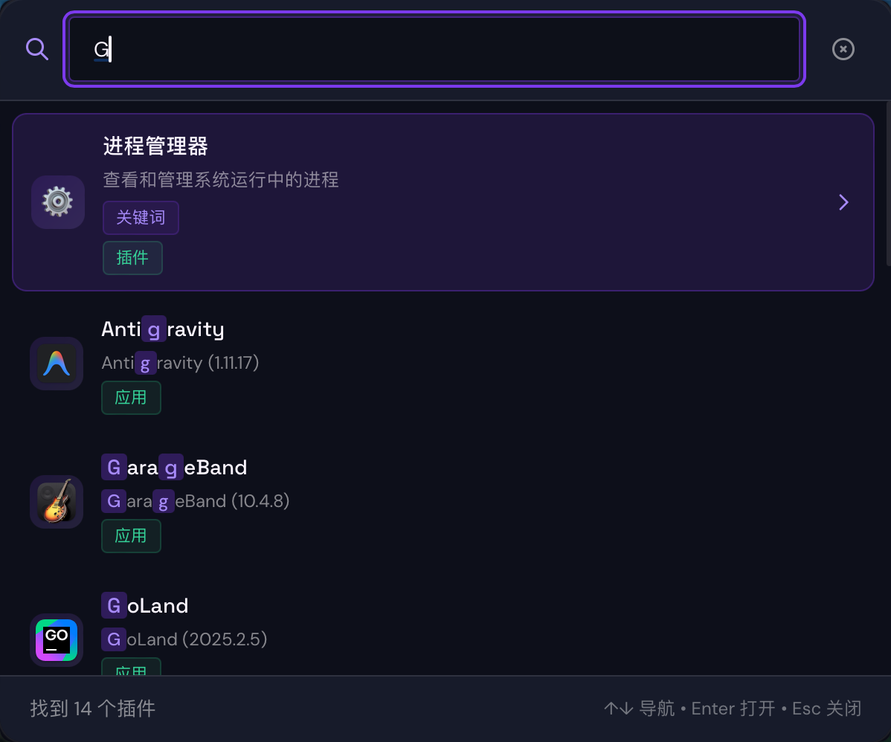
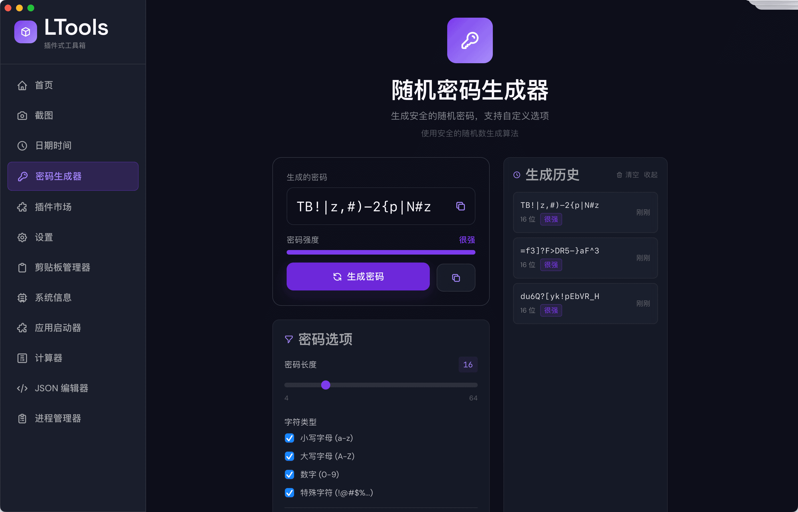

# LTools

<div align="center">

**LTools** - 插件式桌面工具箱

一个基于 Wails v3 构建的现代化跨平台桌面应用，采用插件式架构设计。

[](https://golang.org/)
[](https://react.dev/)
[](https://v3.wails.io/)

</div>

## 功能特性

### 界面预览

<div align="center">
  
  <p>主界面</p>
</div>

<div align="center">
  
  <p>日期时间插件</p>
</div>

<div align="center">
  
  <p>计算器</p>
</div>

<div align="center">
  
  <p>剪贴板管理器</p>
</div>

<div align="center">
  
  <p>JSON 编辑器</p>
</div>

<div align="center">
  
  <p>进程管理器</p>
</div>

<div align="center">
  
  <p>截图工具</p>
</div>

<div align="center">
  
  <p>系统信息</p>
</div>

<div align="center">
  
  <p>插件市场</p>
</div>

<div align="center">
  
  <p>设置（快捷键配置）</p>
</div>

<div align="center">
  
  <p>全局搜索</p>
</div>

<div align="center">
  
  <p>密码生成器</p>
</div>

### 内置插件

- **日期时间** - 实时显示当前日期、时间和星期
- **计算器** - 支持基本运算和历史记录
- **剪贴板管理** - 自动监控并管理剪贴板历史
- **系统信息** - 显示 CPU、内存、运行时间等系统状态
- **JSON 编辑器** - 格式化、验证和编辑 JSON 数据
- **进程管理** - 查看和管理系统进程
- **截图工具** - 截图编辑和管理
- **密码生成器** - 生成安全的随机密码

### 核心功能

- **全局搜索** - 使用快捷键 (Cmd/Ctrl+5) 快速搜索插件
- **快捷键支持** - 自定义全局快捷键触发插件功能
- **系统托盘** - 最小化到系统托盘，保持后台运行
- **插件管理** - 启用/禁用插件，查看插件信息
- **权限系统** - 细粒度的插件权限控制

## 技术栈

### 后端
- **Go 1.25+** - 核心业务逻辑
- **Wails v3 (alpha)** - 跨平台桌面应用框架
- **gohook** - 全局快捷键支持
- **gopsutil** - 系统信息采集
- **screenshot** - 屏幕截图功能

### 前端
- **React 18.2** - UI 框架
- **TypeScript 5.2** - 类型安全
- **Vite 5** - 构建工具
- **TailwindCSS 4** - 样式框架
- **Monaco Editor** - JSON 编辑器

## 项目结构

```
ltools/
├── main.go                 # 应用入口
├── greetservice.go         # 示例服务
├── internal/
│   └── plugins/           # 插件核心架构
│       ├── plugin.go      # 插件接口定义
│       ├── manager.go     # 插件管理器
│       ├── shortcuts.go   # 快捷键管理
│       └── search_window_service.go  # 全局搜索
├── plugins/               # 内置插件实现
│   ├── datetime/
│   ├── calculator/
│   ├── clipboard/
│   ├── sysinfo/
│   ├── jsoneditor/
│   ├── processmanager/
│   └── screenshot/
├── frontend/              # 前端代码
│   ├── src/
│   │   ├── components/   # React 组件
│   │   └── plugins/      # 插件加载器
│   ├── bindings/         # 自动生成的绑定
│   └── dist/             # 构建输出
└── build/                # 构建配置
    ├── config.yml        # 应用配置
    └── Taskfile.yml      # 构建任务
```

## 开发指南

### 前置要求

- **Go** 1.25 或更高版本
- **Node.js** 18 或更高版本
- **Task** (可选，推荐使用)

### 安装依赖

```bash
# 安装 Go 依赖
go mod download

# 安装前端依赖
cd frontend
npm install
cd ..
```

### 开发模式

```bash
# 使用 Task (推荐)
task dev

# 或直接使用 Wails
wails3 dev -config ./build/config.yml -port 9245
```

开发模式支持：
- 前后端热重载
- 自动生成 TypeScript 绑定
- 文件变化监听

### 构建生产版本

```bash
# 构建当前平台
task build

# 或使用 Wails
wails3 build
```

### 生成绑定

```bash
# 生成 TypeScript 绑定
task common:generate:bindings

# 或使用 Wails
wails3 generate bindings -clean=true -ts
```

## 插件开发

### 创建新插件

1. **定义插件结构** - 实现 `Plugin` 接口:

```go
package myplugin

import (
    "github.com/wailsapp/wails/v3/pkg/application"
    "ltools/internal/plugins"
)

type MyPlugin struct {
    *plugins.BasePlugin
}

func NewMyPlugin() *MyPlugin {
    return &MyPlugin{
        BasePlugin: plugins.NewBasePlugin(&plugins.PluginMetadata{
            ID:          "myplugin",
            Name:        "My Plugin",
            Version:     "1.0.0",
            Description: "My plugin description",
            Type:        plugins.PluginTypeBuiltIn,
            Permissions: []plugins.Permission{},
        }),
    }
}
```

2. **创建服务** - 暴露功能给前端:

```go
type MyPluginService struct {
    plugin *MyPlugin
    app    *application.App
}

func NewMyPluginService(plugin *MyPlugin, app *application.App) *MyPluginService {
    return &MyPluginService{plugin: plugin, app: app}
}

func (s *MyPluginService) DoSomething(input string) string {
    return "Result: " + input
}
```

3. **注册插件** - 在 `main.go` 中注册:

```go
// 创建并注册插件
myPlugin := myplugin.NewMyPlugin()
pluginManager.Register(myPlugin)

// 创建并注册服务
myPluginService := myplugin.NewMyPluginService(myPlugin, app)
app.RegisterService(application.NewService(myPluginService))
```

### 插件生命周期

| 方法 | 调用时机 |
|------|----------|
| `Init()` | 插件首次加载时 |
| `ServiceStartup()` | 应用启动时 |
| `ServiceShutdown()` | 应用关闭时 |
| `OnViewEnter()` | 用户导航到插件视图时（可选） |
| `OnViewLeave()` | 用户离开插件视图时（可选） |

## 快捷键

| 快捷键 | 功能 |
|--------|------|
| `Cmd+5` (macOS) / `Ctrl+5` (Windows/Linux) | 打开全局搜索 |
| `Cmd+Shift+S` (macOS) / `Ctrl+Shift+S` (Windows/Linux) | 截图 |

## 系统托盘

应用支持系统托盘集成，提供以下功能：
- 显示/隐藏主窗口
- 查看应用信息
- 退出应用

## 配置

应用配置位于 `build/config.yml`:

```yaml
info:
  productName: "LTools"
  description: "A plugin-based desktop toolbox"
  version: "0.0.1"

dev_mode:
  log_level: warn
  debounce: 1000
```

## 跨平台构建

```bash
# macOS
task darwin:build

# Windows
task windows:build

# Linux
task linux:build
```

## 注意事项

- Wails v3 目前处于 **alpha** 阶段，API 可能发生变化
- macOS 需要 Xcode 命令行工具
- Windows 需要 WebView2 运行时
- 前端绑定文件 (`frontend/bindings/`) 由工具自动生成，请勿手动编辑

## 许可证

本项目采用 MIT 许可证。详见 LICENSE 文件。

## 致谢

- [Wails](https://wails.io/) - 跨平台桌面应用框架
- [React](https://react.dev/) - UI 框架
- [TailwindCSS](https://tailwindcss.com/) - CSS 框架
