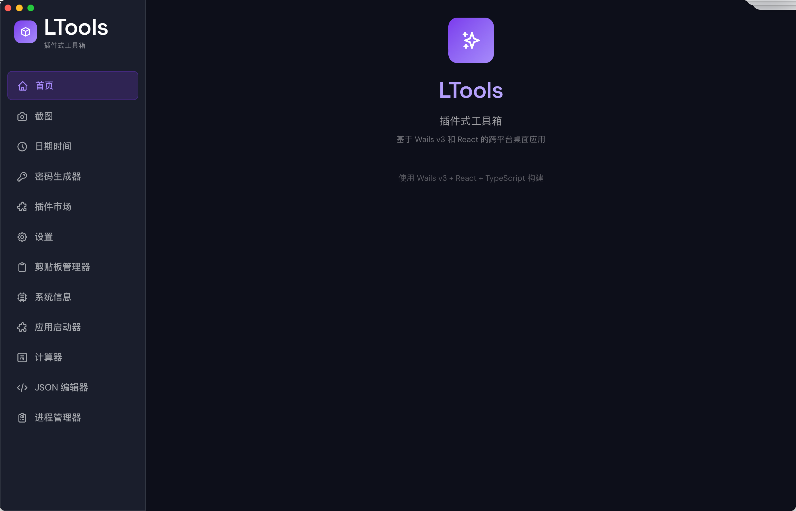
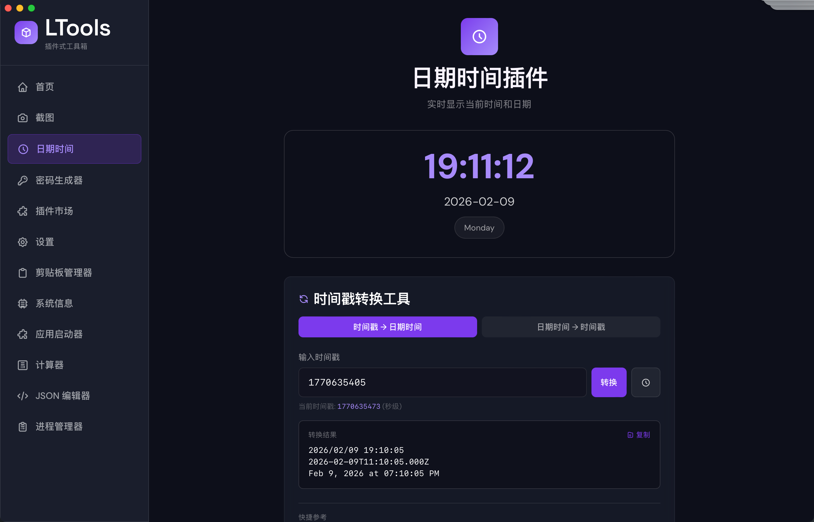
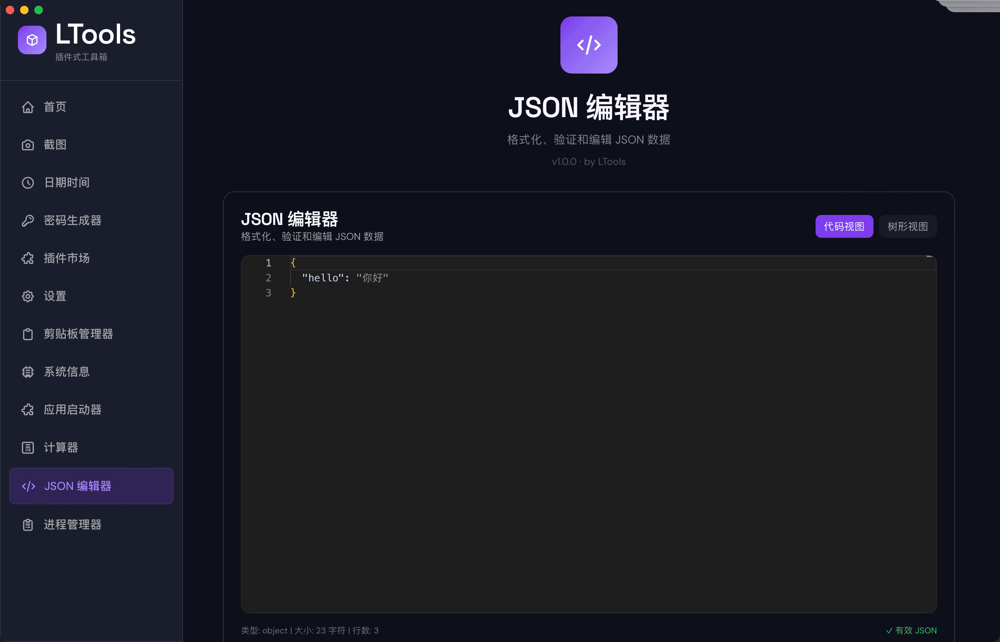
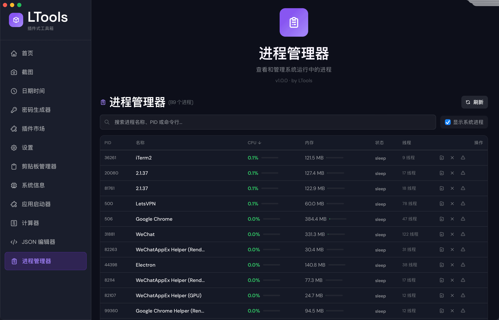
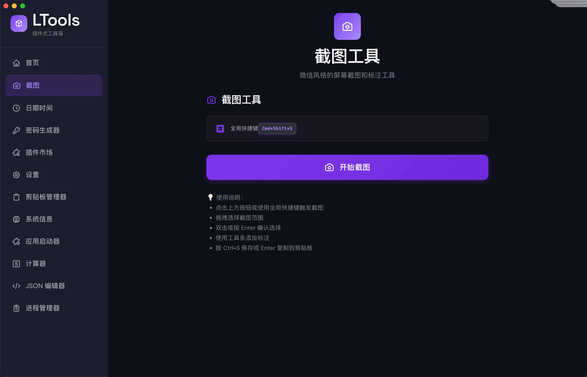
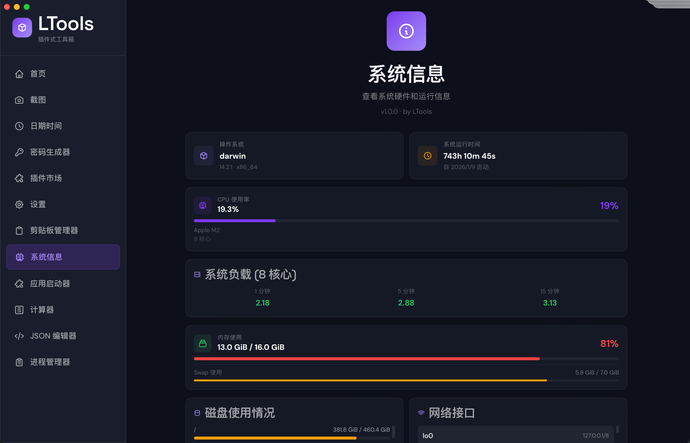
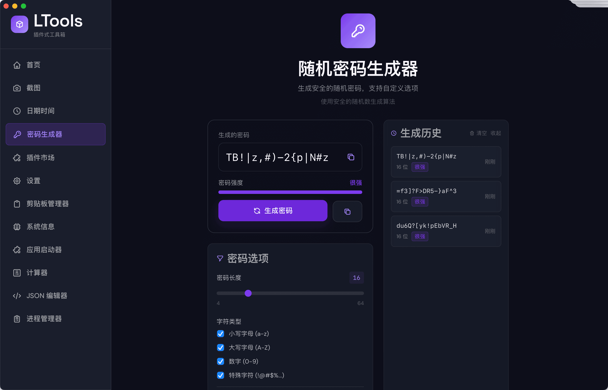

# LTools

<div align="center">

**LTools** - 插件式桌面工具箱

一个基于 Wails v3 构建的现代化跨平台桌面应用，采用插件式架构设计。

[](https://golang.org/)
[](https://react.dev/)
[](https://v3.wails.io/)
[](LICENSE)
[](https://github.com/lian-yang/ltools/releases)

<div align="center">
  <a href="https://github.com/lian-yang/ltools/releases/latest">📥 下载最新版本</a>
  ·
  <a href="https://github.com/lian-yang/ltools/issues">🐛 报告问题</a>
  ·
  <a href="https://github.com/lian-yang/ltools/discussions">💬 讨论</a>
</div>

</div>

## 功能特性

### 界面预览

<div align="center">
  
  <p>主界面</p>
</div>

<div align="center">
  
  <p>日期时间插件</p>
</div>

<div align="center">
  
  <p>计算器</p>
</div>

<div align="center">
  
  <p>剪贴板管理器</p>
</div>

<div align="center">
  
  <p>JSON 编辑器</p>
</div>

<div align="center">
  
  <p>进程管理器</p>
</div>

<div align="center">
  
  <p>截图工具</p>
</div>

<div align="center">
  
  <p>系统信息</p>
</div>

<div align="center">
  
  <p>插件市场</p>
</div>

<div align="center">
  
  <p>设置（快捷键配置）</p>
</div>

<div align="center">
  
  <p>全局搜索</p>
</div>

<div align="center">
  
  <p>密码生成器</p>
</div>

### 内置插件

- **🎵 音乐播放器** - 内置音源服务，支持多音源、歌词同步、播放列表
- **📅 日期时间** - 实时显示当前日期、时间和星期
- **🔢 计算器** - 支持基本运算和历史记录
- **📋 剪贴板管理** - 自动监控并管理剪贴板历史
- **💻 系统信息** - 显示 CPU、内存、运行时间等系统状态
- **📝 JSON 编辑器** - 格式化、验证和编辑 JSON 数据
- **⚙️ 进程管理** - 查看和管理系统进程
- **📸 截图工具** - 截图编辑和管理
- **🔐 密码生成器** - 生成安全的随机密码
- **🔖 书签搜索** - 搜索 Chrome 浏览器书签
- **🌐 Hosts 管理** - 编辑和管理系统 hosts 文件
- **🚇 隧道管理** - SSH 隧道管理工具
- **🔒 密码库** - 本地加密存储密码和敏感信息
- **🌍 IP 信息** - 查询 IP 地址归属信息
- **📌 贴图工具** - 图片置顶显示
- **🤖 AI翻译** - 基于本地模型的离线翻译
- **📄 Markdown** - Markdown 编辑和预览
- **📱 二维码** - 生成和识别二维码
- **🖼️ 图床** - 图片上传和管理
- **📋 看板** - 任务看板管理
- **🚀 应用启动器** - 快速启动应用程序

### 核心功能

- **🔄 自动更新** - 启动 10 秒后自动检查更新，支持静默安装
- **🔍 全局搜索** - 使用快捷键 (Cmd/Ctrl+5) 快速搜索插件
- **⌨️ 快捷键支持** - 自定义全局快捷键触发插件功能
- **🎯 系统托盘** - 最小化到系统托盘，保持后台运行
- **🧩 插件管理** - 启用/禁用插件，查看插件信息
- **🛡️ 权限系统** - 细粒度的插件权限控制

## 技术栈

### 后端
- **Go 1.25+** - 核心业务逻辑
- **Wails v3 (alpha)** - 跨平台桌面应用框架
- **gohook** - 全局快捷键支持
- **gopsutil** - 系统信息采集
- **screenshot** - 屏幕截图功能

### 前端
- **React 18.2** - UI 框架
- **TypeScript 5.2** - 类型安全
- **Vite 5** - 构建工具
- **TailwindCSS 4** - 样式框架
- **Monaco Editor** - JSON 编辑器

## 项目结构

```
ltools/
├── main.go                 # 应用入口
├── internal/
│   └── plugins/           # 插件核心架构
│       ├── plugin.go      # 插件接口定义
│       ├── manager.go     # 插件管理器
│       ├── registry.go    # 插件注册表
│       ├── shortcuts.go   # 快捷键管理
│       └── search_window_service.go  # 全局搜索
├── plugins/               # 内置插件实现
│   ├── musicplayer/      # 🎵 音乐播放器（含音源服务）
│   ├── datetime/         # 日期时间
│   ├── calculator/       # 计算器
│   ├── clipboard/        # 剪贴板管理
│   ├── sysinfo/          # 系统信息
│   ├── jsoneditor/       # JSON 编辑器
│   ├── processmanager/   # 进程管理
│   ├── screenshot2/      # 截图工具
│   ├── password/         # 密码生成器
│   ├── bookmark/         # 书签搜索
│   ├── hosts/            # Hosts 管理
│   ├── tunnel/           # 隧道管理
│   ├── vault/            # 密码库
│   ├── ipinfo/           # IP 信息
│   ├── sticky/           # 贴图工具
│   ├── localtranslate/   # AI翻译
│   ├── markdown/         # Markdown 编辑器
│   ├── qrcode/           # 二维码
│   ├── imagebed/         # 图床
│   ├── kanban/           # 看板
│   └── applauncher/      # 应用启动器
├── lx-music-service/     # 音乐播放器音源服务（独立项目）
├── frontend/              # 前端代码
│   ├── src/
│   │   ├── components/   # React 组件
│   │   ├── hooks/        # 自定义 Hooks
│   │   ├── pages/        # 页面组件
│   │   ├── windows/      # 窗口组件
│   │   ├── router/       # 路由配置
│   │   ├── contexts/     # React Context
│   │   └── utils/        # 工具函数
│   ├── bindings/         # 自动生成的绑定
│   └── dist/             # 构建输出
├── scripts/              # 构建和发布脚本
│   └── generate-update-manifest.sh  # 更新清单生成
├── .github/
│   └── workflows/
│       └── release.yml   # 自动发布 CI/CD
├── RELEASE.md            # 发布说明模板
├── RELEASING.md          # 发布快速参考
└── build/                # 构建配置
    ├── config.yml        # 应用配置
    └── Taskfile.yml      # 构建任务
```

## 安装

### 下载

从 [Releases](https://github.com/lian-yang/ltools/releases) 页面下载最新版本：

| 平台 | 文件 | 说明 |
|------|------|------|
| **macOS** (ARM64) | `ltools-*-darwin-arm64.dmg` | DMG 安装包 (推荐) |
| **macOS** (ARM64) | `ltools-*-darwin-arm64.tar.gz` | Apple Silicon (M1/M2/M3) |
| **macOS** (AMD64) | `ltools-*-darwin-amd64.tar.gz` | Intel Mac |
| **Windows** | `ltools-*-windows-amd64-installer.exe` | NSIS 安装程序 |
| **Linux** | `ltools-*-linux-amd64.AppImage` | AppImage (推荐) |
| **Linux** | `ltools-*-linux-amd64.deb` | Debian/Ubuntu |
| **Linux** | `ltools-*-linux-amd64.rpm` | RHEL/CentOS/Fedora |

> **⚠️ 重要**: 音乐播放器功能需要 **Node.js >= 16.0.0**

### 系统要求

- **Go** 1.25 或更高版本（开发）
- **Node.js** 16.0 或更高版本（音乐播放器需要）
- **Task**（可选，推荐使用）

### 从 Release 安装

### 从 Release 安装

详细安装说明请查看 [Release 页面](https://github.com/lian-yang/ltools/releases) 或 [RELEASE.md](RELEASE.md)。

**macOS 快速安装（DMG 推荐）：**
```bash
# 1. 下载 DMG（以 v1.0.0 为例）
curl -LO https://github.com/lian-yang/ltools/releases/download/v1.0.0/ltools-v1.0.0-darwin-arm64.dmg

# 2. 打开 DMG 并拖拽安装
open ltools-v1.0.0-darwin-arm64.dmg

# 3. 移除隔离属性（重要！）
sudo xattr -rd com.apple.quarantine /Applications/LTools.app

# 4. 启动
open /Applications/LTools.app
```

**macOS tar.gz 安装：**
```bash
# 1. 下载（以 v1.0.0 为例）
curl -LO https://github.com/lian-yang/ltools/releases/download/v1.0.0/ltools-v1.0.0-darwin-arm64.tar.gz

# 2. 解压
tar xzf ltools-v1.0.0-darwin-arm64.tar.gz

# 3. 安装
mv LTools.app /Applications/

# 4. 移除隔离属性（重要！）
sudo xattr -rd com.apple.quarantine /Applications/LTools.app

# 5. 启动
open /Applications/LTools.app
```

> **📖 macOS 安全性问题**：遇到"已损坏"提示？查看 [macOS 安全性快速参考](docs/macOS_SECURITY.md)

## 开发指南

### 安装依赖

```bash
# 安装 Go 依赖
go mod download

# 安装前端依赖
cd frontend
npm install
cd ..
```

### 开发模式

```bash
# 使用 Task (推荐)
task dev

# 或直接使用 Wails
wails3 dev -config ./build/config.yml -port 9245
```

开发模式支持：
- 前后端热重载
- 自动生成 TypeScript 绑定
- 文件变化监听

### 构建生产版本

```bash
# 构建当前平台
task build

# 或使用 Wails
wails3 build
```

### 生成绑定

```bash
# 生成 TypeScript 绑定
task common:generate:bindings

# 或使用 Wails
wails3 generate bindings -clean=true -ts
```

## 插件开发

### 创建新插件

1. **定义插件结构** - 实现 `Plugin` 接口:

```go
package myplugin

import (
    "github.com/wailsapp/wails/v3/pkg/application"
    "ltools/internal/plugins"
)

type MyPlugin struct {
    *plugins.BasePlugin
}

func NewMyPlugin() *MyPlugin {
    return &MyPlugin{
        BasePlugin: plugins.NewBasePlugin(&plugins.PluginMetadata{
            ID:          "myplugin",
            Name:        "My Plugin",
            Version:     "1.0.0",
            Description: "My plugin description",
            Type:        plugins.PluginTypeBuiltIn,
            Permissions: []plugins.Permission{},
        }),
    }
}
```

2. **创建服务** - 暴露功能给前端:

```go
type MyPluginService struct {
    plugin *MyPlugin
    app    *application.App
}

func NewMyPluginService(plugin *MyPlugin, app *application.App) *MyPluginService {
    return &MyPluginService{plugin: plugin, app: app}
}

func (s *MyPluginService) DoSomething(input string) string {
    return "Result: " + input
}
```

3. **注册插件** - 在 `main.go` 中注册:

```go
// 创建并注册插件
myPlugin := myplugin.NewMyPlugin()
pluginManager.Register(myPlugin)

// 创建并注册服务
myPluginService := myplugin.NewMyPluginService(myPlugin, app)
app.RegisterService(application.NewService(myPluginService))
```

### 插件生命周期

| 方法 | 调用时机 |
|------|----------|
| `Init()` | 插件首次加载时 |
| `ServiceStartup()` | 应用启动时 |
| `ServiceShutdown()` | 应用关闭时 |
| `OnViewEnter()` | 用户导航到插件视图时（可选） |
| `OnViewLeave()` | 用户离开插件视图时（可选） |

## 快捷键

| 快捷键 | 功能 |
|--------|------|
| `Cmd+5` (macOS) / `Ctrl+5` (Windows/Linux) | 打开全局搜索 |
| `Cmd+Shift+S` (macOS) / `Ctrl+Shift+S` (Windows/Linux) | 截图 |

> 自定义快捷键：在设置页面中配置

## 自动更新

LTools 内置自动更新机制：

- ✅ 应用启动 10 秒后自动检查更新
- ✅ 发现新版本时显示更新通知
- ✅ 支持手动检查（设置 → 关于 → 检查更新）
- ✅ Windows: 静默安装并重启
- ✅ macOS/Linux: 下载提示，手动替换

**更新方式**：
- **Windows**: 下载新版本安装程序 → 静默安装 → 重启应用
- **macOS**: 下载 .app bundle → 替换 /Applications/LTools.app → 重启应用
- **Linux**: 下载 AppImage → 替换旧版本 → 重启应用

## 系统托盘

应用支持系统托盘集成，提供以下功能：
- 显示/隐藏主窗口
- 查看应用信息
- 退出应用

## 配置

应用配置位于 `build/config.yml`:

```yaml
info:
  productName: "LTools"
  description: "A plugin-based desktop toolbox"
  version: "0.0.1"

dev_mode:
  log_level: warn
  debounce: 1000
```

## 跨平台构建

```bash
# macOS
task darwin:build

# Windows
task windows:build

# Linux
task linux:build
```

## 注意事项

### 开发环境
- Wails v3 目前处于 **alpha** 阶段，API 可能发生变化
- macOS 需要 Xcode 命令行工具
- Windows 需要 WebView2 运行时
- 前端绑定文件 (`frontend/bindings/`) 由工具自动生成，请勿手动编辑

### 音乐播放器
- 需要 **Node.js >= 16.0.0**
- 首次运行时，音源服务会自动提取到用户配置目录
- 支持多音源切换和自动代理

### macOS 安全性
首次打开可能会提示"已损坏"，这是正常的：
```bash
# 一键解决
sudo xattr -rd com.apple.quarantine /Applications/LTools.app
```

详细说明：[macOS 安全性快速参考](docs/macOS_SECURITY.md)

## 文档

- [CLAUDE.md](CLAUDE.md) - Claude Code 项目指南
- [RELEASE.md](RELEASE.md) - 发布说明模板
- [RELEASING.md](RELEASING.md) - 发布快速参考
- [发布流程指南](docs/RELEASE_PROCESS.md) - 详细发布流程
- [macOS 安全性](docs/macOS_SECURITY.md) - macOS 安全性问题排查
- [自动更新文档](docs/AUTO_UPDATE.md) - 自动更新实现

## 贡献

欢迎提交 Issue 和 Pull Request！

### 发布新版本

查看 [发布快速参考](RELEASING.md) 或 [完整发布流程](docs/RELEASE_PROCESS.md)。

## 注意事项（旧）

- Wails v3 目前处于 **alpha** 阶段，API 可能发生变化
- macOS 需要 Xcode 命令行工具
- Windows 需要 WebView2 运行时
- 前端绑定文件 (`frontend/bindings/`) 由工具自动生成，请勿手动编辑

## 许可证

本项目采用 MIT 许可证。详见 LICENSE 文件。

## 致谢

- [Wails](https://wails.io/) - 跨平台桌面应用框架
- [React](https://react.dev/) - UI 框架
- [TailwindCSS](https://tailwindcss.com/) - CSS 框架
